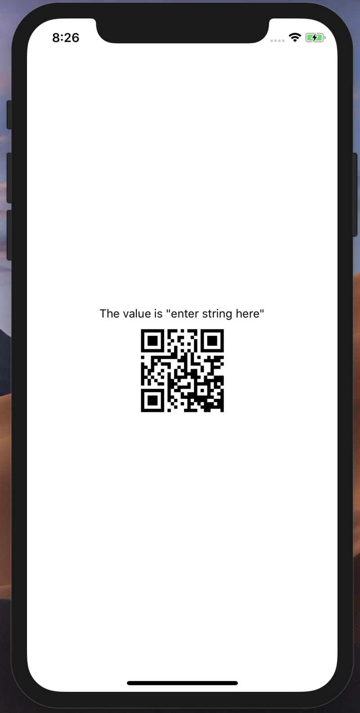

## Modular 8-2019

# QR Code Generator

Generates a QR code for both React (web) and React Native.

## 1 | Preview



## 2 | Getting Started

### 2.1 Installing

Clone, then run

```
npm install
```

inside the directory.

You can alter the value of the QR code inside `App.js`.

### 2.2 Running

To run in web:

```
npm run web
```

To run in mobile with Expo and mobile simulator:

```
npm run start
```
